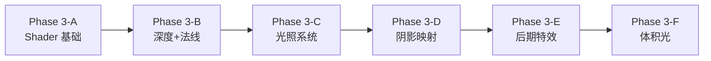

# HD-2D 渲染系统实现路线图

基于 Project Rinn 当前进度，本文档定义从当前状态到 HD-2D 渲染效果的**分阶段实现计划**。

---

## 项目现状分析

### 已完成 ✅

| 模块 | 完成度 | 说明 |
|------|--------|------|
| ECS Core | 100% | Registry, SparseSet, View, EntityPool |
| Lua 绑定 | 85% | ScriptContext, LuaBinder 基础绑定 |
| RenderSystem | 基础 | Raylib 窗口、`DrawTexture()` 绘制 |
| ResourceManager | 基础 | 纹理加载、ID 索引 |
| Components | 基础 | `Transform(x,y,layer)`, `Sprite(texture_id)` |

### 缺失 ❌

| HD-2D 必要模块 | 当前状态 |
|----------------|----------|
| **Shader 系统** | 无任何 GLSL 代码 |
| **深度缓冲** | 无 Z-Buffer 支持 |
| **法线贴图渲染** | 无法线采样 |
| **光照系统** | 无点光源/平行光 |
| **阴影映射** | 无 Shadow Pass |
| **后期特效** | 无 Bloom/Tilt-Shift/LUT |
| **体积光** | 无 Raymarching |
| **FBO 离屏渲染** | 无多 Pass 架构 |

---

## 关键技术约束

> [!IMPORTANT]
> **技术路线决策**：保持 Raylib 作为平台层，使用 **rlgl.h** 进行低级渲染控制。

### 技术方案：Raylib + rlgl.h

| 层级 | 职责 | 使用的 API |
|------|------|------------|
| **Raylib 高级 API** | 窗口/输入/音频/纹理加载 | `InitWindow()`, `LoadTexture()` |
| **rlgl.h 低级 API** | FBO/深度/多纹理/Shader | `rlLoadFramebuffer()`, `rlEnableDepthTest()` |
| **直接 OpenGL** | 备用 (如 rlgl 不足) | `glBindTexture()`, `glUniform*()` |

### rlgl.h 关键函数

```c
// FBO 操作
rlLoadFramebuffer()       // 创建 FBO
rlFramebufferAttach()     // 附加纹理
rlEnableFramebuffer()     // 启用 FBO

// 深度控制
rlEnableDepthTest()       // 启用深度测试
rlEnableDepthMask()       // 启用深度写入

// 多纹理
rlActiveTextureSlot(int)  // 激活纹理槽
rlEnableTexture(id)       // 绑定纹理

// Shader
rlSetUniform()            // 设置 Uniform
rlSetUniformMatrix()      // 设置矩阵 Uniform
```

### 混合使用示例

```cpp
#include "rlgl.h"

// Raylib 高级 API 创建资源
RenderTexture2D shadowMap = LoadRenderTexture(1024, 1024);
Shader lightShader = LoadShader("light.vert", "light.frag");

// rlgl.h 低级控制
rlEnableDepthTest();
rlActiveTextureSlot(1);
rlEnableTexture(shadowMap.depth.id);
SetShaderValue(lightShader, loc, &slot, SHADER_UNIFORM_INT);
```

---

## 分阶段实现计划

### Phase 3-A: Shader 基础设施 (预计 4-6 天)

**目标**：建立 Shader 系统框架，掌握 rlgl.h，实现第一个自定义 Shader

#### 任务清单

1. **学习 rlgl.h API** ⭐ 新增
   - 阅读 Raylib 源码中的 `rlgl.h`
   - 测试 FBO 创建和使用
   - 测试多纹理绑定

2. **创建 Shader 管理器**
   - `src/Resources/ShaderManager.hpp`
   - RAII 封装 Raylib `Shader` 资源
   - 路径加载 + 热重载预留接口

3. **扩展 Components**
   - `Material` 组件（shader_id, 材质参数）
   - `Light` 组件（position, color, intensity, radius）

4. **实现基础 Shader**
   - `shaders/sprite.vert` - 基础顶点变换
   - `shaders/sprite.frag` - 漫反射 + 自发光

5. **修改 RenderSystem**
   - 引入 `#include "rlgl.h"`
   - `BeginShaderMode()`/`EndShaderMode()` 包裹渲染
   - Shader Uniform 传递（时间、摄像机位置）

---

### Phase 3-B: 深度与法线 (预计 3-5 天)

**目标**：实现 Z-Buffer 和法线贴图渲染

#### 任务清单

1. **扩展 Sprite 组件**
   ```cpp
   struct Sprite {
       uint16_t albedo_id;   // 漫反射贴图
       uint16_t normal_id;   // 法线贴图 (可选)
       float z_depth;        // 深度值
   };
   ```

2. **法线贴图 Shader**
   - `shaders/normal_lit.frag`
   - 法线空间光照计算
   - 球形法线近似修正

3. **深度排序渲染**
   - 按 `z_depth` 排序绘制
   - 或使用 Raylib 3D 模式 + 透明度裁剪

---

### Phase 3-C: 光照系统 (预计 5-7 天)

**目标**：实现多光源实时光照

#### 任务清单

1. **Light 组件**
   ```cpp
   struct Light {
       float x, y, z;
       Color color;
       float intensity;
       float radius;
       enum { Point, Directional } type;
   };
   ```

2. **光照 Shader**
   - `shaders/lit_sprite.frag`
   - 支持最多 8 个动态光源
   - Blinn-Phong 或简化 PBR

3. **LightSystem 类**
   - 遍历 Light 组件
   - 将光源数据打包为 Uniform 数组

---

### Phase 3-D: 阴影映射 (预计 5-7 天)

**目标**：实现基础 Shadow Mapping

#### 任务清单

1. **创建 RenderTexture**
   - `shadow_map` FBO (深度纹理)
   - 从光源视角渲染深度

2. **Shadow Pass**
   - `shaders/shadow_depth.vert/frag`
   - 输出深度到 `shadow_map`

3. **Lighting Pass 修改**
   - 采样 `shadow_map`
   - PCF 软阴影滤波

---

### Phase 3-E: 后期特效 (预计 5-7 天)

**目标**：实现 Bloom + Tilt-Shift + LUT

#### 任务清单

1. **多 Pass 架构**
   - Scene → Bloom → Tilt-Shift → LUT → Final

2. **Bloom Shader**
   - `shaders/bloom_threshold.frag` - 提取高亮
   - `shaders/bloom_blur.frag` - 高斯模糊
   - `shaders/bloom_composite.frag` - 叠加

3. **Tilt-Shift Shader**
   - 基于屏幕 Y 坐标的模糊权重

4. **LUT 调色**
   - 3D LUT 采样或 2D 条状 LUT

---

### Phase 3-F: 体积光 (进阶，可选)

**目标**：实现 God Rays 效果

#### 任务清单

1. **Raymarching Shader**
   - 屏幕空间光线步进
   - 采样 Shadow Map 判断遮挡

2. **体积光合成**
   - 半分辨率渲染
   - 双线性上采样合成

---

## 美术资源工作流

### 当前可使用

Raylib 的 `LoadTexture()` 可直接加载 PNG，无需额外工具。

### 需要准备

| 资源类型 | 工具 | 说明 |
|----------|------|------|
| **法线贴图** | [Laigter](https://azagaya.itch.io/laigter) | 免费，从 Albedo 生成法线 |
| **LUT** | Photoshop / GIMP | 导出调色映射 |
| **噪声图** | [Blue Noise Generator](https://momentsingraphics.de/BlueNoise.html) | 用于抖动透明 |

---

## 推荐实现顺序



> [!TIP]
> **建议**：每个 Phase 完成后，写一个可视化 Demo 验证效果。遵循项目宣言的"曳光弹法则"——看不见的功能等于不存在。

---

## 验证计划

### 自动化测试

当前项目无自动化测试框架。建议：
- 每个 Shader 编写后，用 `IsShaderReady()` 验证编译成功
- 手动截图对比前后效果

### 手动验证步骤

1. **Shader 基础**：替换 `DrawTexture()` 为 Shader 渲染，确认画面一致
2. **法线贴图**：添加一个点光源，观察 Sprite 是否有明暗变化
3. **阴影**：在光源和 Sprite 之间放置遮挡物，观察阴影投射
4. **Bloom**：加载一张高亮贴图，观察边缘光晕
5. **体积光**：在遮挡物后放置光源，观察 God Rays

---

## 开发建议

> [!CAUTION]
> **不要一次性全部实现**。HD-2D 渲染是一个渐进式的技术栈。按 Phase 拆分，每个 Phase 都能独立验证和展示。

### 最小可行产品 (MVP)

如果时间有限，优先完成：
1. **Phase 3-A** (Shader 基础) - 证明你能写 Shader
2. **Phase 3-B** (法线贴图) - HD-2D 的核心差异化
3. **Phase 3-E 的 Bloom** - 视觉冲击最大

这三个加起来就能让画面从"普通像素游戏"升级到"有高级感的像素游戏"。

---

## 文件结构预览

完成 Phase 3 后的预期目录结构：

```
src/
├── Core/           # ECS 核心 (已完成)
├── Systems/
│   ├── RenderSystem.hpp      # 扩展：多 Pass 渲染
│   ├── LightSystem.hpp       # 新增：光源管理
│   └── PostProcessSystem.hpp # 新增：后期特效
├── Resources/
│   ├── ResourceManager.hpp   # 已有
│   └── ShaderManager.hpp     # 新增
├── components/
│   └── Components.hpp        # 扩展：Material, Light
└── Scripting/      # Lua 绑定 (已完成)

shaders/
├── sprite.vert
├── sprite.frag
├── normal_lit.frag
├── shadow_depth.vert
├── shadow_depth.frag
├── bloom_threshold.frag
├── bloom_blur.frag
├── bloom_composite.frag
├── tilt_shift.frag
└── lut.frag

assets/
├── textures/
│   ├── {Name}_Albedo.png
│   ├── {Name}_Normal.png
│   └── {Name}_Emission.png
└── lut/
    └── default.png
```
