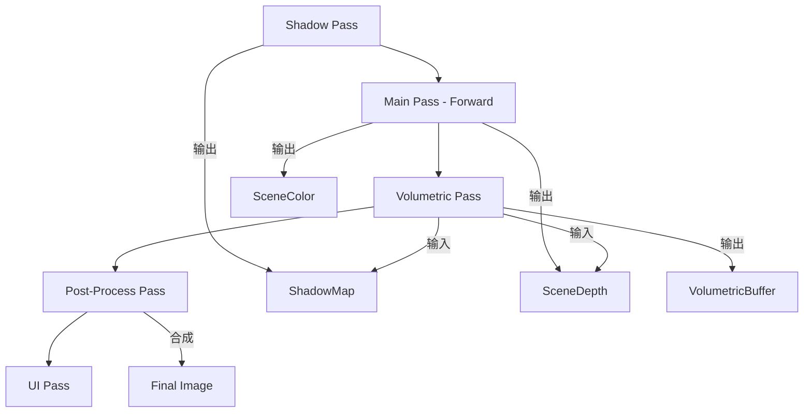

本文档定义了 HD-2D 风格渲染引擎的核心技术架构与美术资源标准。

---

## 第一部分：核心渲染架构

### 1. 摄像机系统

| 属性 | 配置 |
|------|------|
| 投影模式 | **低 FOV 透视投影** (15° - 30°) |
| 摄像机距离 | 拉远，保持近乎等距视觉 |

**设计原理：**
- 放弃纯正交投影。正交模式下 Z 轴距离不影响物体大小，无法产生真实的移轴模糊和体积雾效果。
- 低 FOV 透视既保留像素画的"整齐感"，又获得真实的 Z 轴深度关系，让后期特效产生正确的"厚度感"。

---

### 2. 渲染管线

采用 **前向渲染 (Forward Rendering)**，原因如下：

- **透明度友好**：HD-2D 本质是大量半透明 Sprite 叠加（特效、树叶遮挡等），延迟渲染处理半透明非常困难。
- **架构简洁**：单人开发无需维护两套光照管线。
- **性能匹配**：HD-2D 同屏 10-20 个高质量光源足以营造氛围，不需要延迟渲染的多光源优势。

> [!TIP]
> 若后期光源数量增加导致性能问题，可升级为 **Clustered Forward (分簇前向渲染)**。

---

### 3. 深度与透明度处理

| 技术 | 说明 |
|------|------|
| **Z-Buffer** | 所有 Sprite 分配 Z 轴坐标，实现正确遮挡 |
| **Alpha Cutout** | Shader 中 `discard` Alpha < 0.1 的像素 |
| **Dithered Transparency** | 使用噪声图实现"挖洞式"透明，避免排序问题 |

---

## 第二部分：光照与材质系统

### 1. 法线贴图渲染

**核心修正：球形法线近似 (Spherical Normal Approximation)**

Sprite 是始终朝向摄像机的 Billboard，为防止光照随相机旋转而"滑动"：
- 忽略法线贴图的 Z 轴分量
- 或将法线模拟为半圆柱体/球体
- 确保光照立体感稳定

---

### 2. 实时阴影系统

| 阶段 | 处理内容 |
|------|----------|
| **Shadow Pass** | 从光源视角渲染场景深度到 `ShadowMap` |
| **Lighting Pass** | 主渲染时对比深度，生成实时阴影 |
| **Contact Shadows** | 屏幕空间 Raymarching，填补脚底缝隙 |

**接触阴影 (Screen Space Contact Shadows)**：
- 解决"彼得潘效应"（脚底悬空感）
- 在 Shadow Map 基础上增加短距离光线步进

---

### 3. 高级光照特性

| 特性 | 说明 |
|------|------|
| **双面材质 (Two-Sided)** | 支持背光情况下的边缘照明 |
| **背光透射 (Translucency)** | 模拟次表面散射，产生 Rim Light 边缘光 |

---

## 第三部分：体积光系统

体积光是 HD-2D 的灵魂，提供"空气感"和"神圣感"。

### 实现方案：基于阴影贴图的体积光散射

**算法流程：**

1. **复用 Shadow Map**：判断空气中某点是否被遮挡
2. **光线步进 (Raymarching)**：
   - 从摄像机向每个像素发射射线
   - 沿射线每隔一段距离采样
   - 将采样点坐标转换到光源空间查询 Shadow Map
   - 未遮挡点累加亮度，遮挡点不累加
3. **产生 God Rays**：光线穿过树木/窗户时，形成明暗相间的光柱

> [!IMPORTANT]
> 体积光通道通常使用半分辨率渲染以优化性能。

---

## 第四部分：后期特效管线

### 1. 抗锯齿策略

**核心矛盾**：像素锐利度 vs 3D 边缘平滑度

| 方案 | 说明 |
|------|------|
| **SMAA + Stencil Mask** | 只对 3D 几何体抗锯齿，保护 Sprite 像素边缘 |
| **Super Sampling** | 2 倍分辨率渲染后降采样（高配方案） |

> [!CAUTION]
> 避免全局 FXAA，会导致像素角色边缘模糊。

---

### 2. 后期特效栈

| 特效 | 作用 |
|------|------|
| **移轴模糊 (Tilt-Shift)** | 基于深度缓冲的上下模糊，营造微缩模型感 |
| **辉光 (Bloom)** | 提取高亮区域模糊叠加，产生"溢出"感 |
| **LUT 调色** | 通过颜色映射表统一全屏色调 |

---

## 第五部分：完整渲染流程



### 各通道职责

| 通道 | 处理内容 |
|------|----------|
| **Shadow Pass** | 渲染场景深度到 `ShadowMap` |
| **Main Pass** | 绘制所有物体，应用 PBR 光照、法线贴图 |
| **Volumetric Pass** | Raymarching 计算雾的浓度和颜色 |
| **Post-Process** | 混合体积光 → Bloom → Tilt-Shift → LUT 调色 |
| **UI Pass** | 绘制 ImGui 和游戏 UI |

---

## 第六部分：美术资源规范

### 1. 漫反射贴图 (Albedo Map)

| 属性 | 要求 |
|------|------|
| 文件命名 | `{Name}_Albedo.png` |
| 光照要求 | **绝对平光 (Delighted)** |
| 检查点 | 无固定高光或阴影 |

> [!WARNING]
> 贴图自带光影会导致与引擎实时光照冲突，产生"双重阴影"等视觉错误。

**AI 生成提示词关键：** `flat lighting`, `neutral lighting`, `even illumination`

---

### 2. 法线贴图 (Normal Map)

| 属性 | 要求 |
|------|------|
| 文件命名 | `{Name}_Normal.png` |
| 视觉特征 | 蓝紫色调 |
| 获取方式 | 工具生成（Laigter / NormalMap-Online） |

**作用**：通过 RGB 值记录每个像素的法线方向，让 2D Sprite 产生 3D 受光效果。

---

### 3. RMA 复合遮罩贴图 (Packed Mask Map)

> [!IMPORTANT]
> 这是商业引擎的标准做法，将多张灰度图合并为单张彩色图，极大节省显存带宽。

| 通道 | 数据 | 黑色含义 | 白色含义 |
|------|------|----------|----------|
| 🔴 R | Roughness | 光滑（水面/玻璃） | 粗糙（布料/石头） |
| 🟢 G | Metallic | 非金属（木头） | 金属（黄金） |
| 🔵 B | AO | 完全受光 | 完全遮蔽 |

| 属性 | 要求 |
|------|------|
| 文件命名 | `{Name}_RMA.png` |
| Shader 采样 | 单次采样获取所有物理属性 |

---

### 4. 自发光贴图 (Emission Map)

| 属性 | 要求 |
|------|------|
| 文件命名 | `{Name}_Emission.png` |
| 视觉特征 | 黑色背景，仅发光部位有颜色 |
| 应用场景 | 药水液体、魔法阵、窗户灯光 |

---

### 5. 抖动噪声图 (Blue Noise Texture)

| 属性 | 要求 |
|------|------|
| 文件命名 | `BlueNoise.png` |
| 视觉特征 | 类似电视雪花的灰度图 |
| 用途 | Dithered Transparency 抖动透明 |

**应用场景**：当角色被树木遮挡时，根据噪声图"挖洞"式隐藏树木像素，避免半透明排序问题。

---

### 6. LUT 调色表 (Look-Up Table)

| 属性 | 要求 |
|------|------|
| 文件规格 | 512×512 或 256×16 |
| 获取方式 | Photoshop 调色后应用到标准 LUT 原图导出 |

---

## 第七部分：资产目录结构

每个游戏对象的完整资产包结构：

```
Assets/
├── Characters/
│   └── Player/
│       ├── Player_Albedo.png     # 平光颜色
│       ├── Player_Normal.png     # 法线信息
│       ├── Player_RMA.png        # 复合材质遮罩
│       └── Player_Emission.png   # 自发光（可选）
├── Props/
│   └── Potion/
│       ├── Potion_Albedo.png
│       ├── Potion_Normal.png
│       ├── Potion_RMA.png
│       └── Potion_Emission.png
├── Environment/
│   └── ...
└── Global/
    ├── BlueNoise.png             # 抖动噪声
    └── LUT_Default.png           # 默认调色表
```

---

## 第八部分：性能优化策略

| 优化技术 | 说明 |
|----------|------|
| **批次渲染 (Batch Rendering)** | 合并相同材质的 Draw Call |
| **RMA 通道打包** | 减少纹理采样次数 (3次 → 1次) |
| **体积光半分辨率** | 降低 Raymarching 计算量 |
| **Compute Shader** | 加速后期模糊算法（可选） |
| **CSM 级联阴影** | 保证近处阴影分辨率，远处降低 |

---

## 总结

Project Rinn HD-2D 引擎的核心技术要点：

1. **几何光学**：低 FOV 透视摄像机，支持真实的移轴和体积雾
2. **2.5D 光照**：球形法线近似 + 接触阴影，消除"纸片感"和"浮空感"
3. **体积光**：基于 Shadow Map 的 Raymarching，产生 God Rays 光柱效果
4. **资源打包**：RMA Mask Map 合并通道，减少纹理采样压力
5. **智能抗锯齿**：Stencil Mask 保护像素边缘锐利度