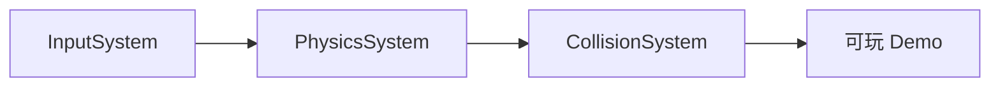

# Project Rinn 完整引擎架构

**Systemic Narrative Engine** - 系统性涌现玩法引擎

---

## 设计铁律

> 一切架构决策必须通过这三条铁律审核

### 铁律一：CPU 痛恨内存跳转
- ✅ 组件存于 `SparseSet.Dense`（连续内存）
- ✅ 遍历使用 `view<T>()` 线性扫描
- ❌ 禁止: 指针追逐、虚函数热路径遍历

### 铁律二：显式 Pipeline
- ✅ 所有 System 调用顺序在 `main.cpp` 中硬编码
- ✅ `World` 是纯 struct，无任何方法
- ✅ System 是 namespace + 自由函数
- ❌ 禁止: EventBus、Callbacks、任何隐式控制流

### 铁律三：复杂度物理限制
- ✅ O(N) 优先
- ⚠️ O(N²) 仅限 N < 50
- 🔴 N > 50 必须空间划分

### 三层数据模型
| 层级 | 内容 | 存储 |
|------|------|------|
| **实体层** | 动态组件 (Transform, Velocity) | Registry (SparseSet) |
| **环境层** | 静态地图 (TileMap) | Dense Array |
| **上下文层** | 全局状态 (time, dt) | World.ctx |

---

## 引擎愿景

构建一个基于 C++20 的 **HD-2D 风格系统性涌现引擎**，特点：
- **Data-Oriented Design (DOD)**：ECS 架构，缓存友好
- **Lua 驱动策略**：C++ 负责机制，Lua 负责策略
- **HD-2D 渲染**：2D 像素 + 3D 光影的视觉风格
- **工业级健壮**：10k+ 实体，内存安全

---

## 完整模块地图

```
┌──────────────────────────────────────────────────────────────────────┐
│                         PROJECT RINN ENGINE                          │
├──────────────────────────────────────────────────────────────────────┤
│  ┌─────────────────────────────────────────────────────────────────┐ │
│  │                     GAME LAYER (Lua 脚本)                       │ │
│  │  • 游戏逻辑 / AI 行为 / 关卡规则 / 对话系统                      │ │
│  └─────────────────────────────────────────────────────────────────┘ │
│                                  ▼                                   │
│  ┌─────────────────────────────────────────────────────────────────┐ │
│  │                      SYSTEMS LAYER (C++)                         │ │
│  │  ┌──────────┐ ┌──────────┐ ┌──────────┐ ┌──────────┐            │ │
│  │  │  Render  │ │  Physics │ │  Input   │ │  Audio   │            │ │
│  │  │  System  │ │  System  │ │  System  │ │  System  │            │ │
│  │  └──────────┘ └──────────┘ └──────────┘ └──────────┘            │ │
│  │  ┌──────────┐ ┌──────────┐ ┌──────────┐ ┌──────────┐            │ │
│  │  │Animation │ │Collision │ │  Script  │ │  Camera  │            │ │
│  │  │ System   │ │  System  │ │  System  │ │  System  │            │ │
│  │  └──────────┘ └──────────┘ └──────────┘ └──────────┘            │ │
│  └─────────────────────────────────────────────────────────────────┘ │
│                                  ▼                                   │
│  ┌─────────────────────────────────────────────────────────────────┐ │
│  │                        CORE LAYER (C++)                          │ │
│  │  ┌──────────────────────────────────────────────────────────┐   │ │
│  │  │  ECS: Registry / SparseSet / View / EntityPool           │   │ │
│  │  └──────────────────────────────────────────────────────────┘   │ │
│  │  ┌──────────┐ ┌──────────┐ ┌──────────┐ ┌──────────┐            │ │
│  │  │ Resource │ │  World   │ │  Scene   │ │ Serialize│            │ │
│  │  │ Manager  │ │ (struct) │ │ Manager  │ │  System  │            │ │
│  │  └──────────┘ └──────────┘ └──────────┘ └──────────┘            │ │
│  └─────────────────────────────────────────────────────────────────┘ │
│                                  ▼                                   │
│  ┌─────────────────────────────────────────────────────────────────┐ │
│  │                      PLATFORM LAYER                              │ │
│  │        Raylib (渲染/输入/音频)  │  Sol2 (Lua 绑定)               │ │
│  └─────────────────────────────────────────────────────────────────┘ │
└──────────────────────────────────────────────────────────────────────┘
```

---

## 模块详细说明

### Tier 0: Core Layer (核心层)

| 模块                  | 职责                         | 当前状态         |
| ------------------- | -------------------------- | ------------ |
| **ECS Core**        | Entity/Component/System 架构 | ✅ 100%       |
| **ResourceManager** | 纹理/Shader/音频资源池            | ⚠️ 30% (仅纹理) |
| **PrefabManager**   | 实体模板生成                     | ✅ 100%       |
| **World**           | 纯数据容器 (struct, 无方法)        | ✅ 100%       |
| **SceneManager**    | 场景切换                       | ❌ 未实现        |
| **Serialization**   | 存档/读档、JSON 序列化             | ❌ 未实现        |

---

### Tier 1: Systems Layer (系统层)

#### 必须实现 🔴

| System | 职责 | 输入组件 | 输出 | 状态 |
|--------|------|----------|------|------|
| **InputSystem** | 键盘/鼠标/手柄 | - | 事件/状态查询 | ✅ 100% |
| **PhysicsSystem** | 速度 → 位置更新 | `Transform`, `Velocity` | 位置变化 | ✅ 100% |
| **CollisionSystem** | 碰撞检测+解决 | `Transform`, `Collider` | 位置修正 | ✅ 100% |
| **RenderSystem** | 绘制 Sprite | `Transform`, `Sprite` | 画面 | ⚠️ 基础 |
| **AudioSystem** | 音效/BGM | `AudioSource` | 声音 | ❌ |
| **AnimationSystem** | 序列帧动画 | `Animator`, `Sprite` | UV 切换 | ❌ |
| **ScriptSystem** | 执行 Lua 意图 | - | 意图声明 | ✅ 100% |

#### 高级能力 🟡

| System | 职责 | 状态 |
|--------|------|------|
| **CameraSystem** | 跟随/震动/平滑 | ❌ |
| **ParticleSystem** | 粒子特效 | ❌ |
| **AISystem** | 行为树/FSM | ❌ |
| **PathfindingSystem** | A* 寻路 | ❌ |

---

### Tier 2: Rendering Pipeline (渲染管线)

**技术路线**: Raylib + rlgl.h (低级渲染控制)

| 层级 | 职责 | API |
|------|------|-----|
| Raylib 高级 | 窗口/输入/纹理加载 | `LoadTexture()` |
| rlgl.h 低级 | FBO/深度/多纹理 | `rlLoadFramebuffer()` |
| 直接 OpenGL | 备用 | `glUniform*()` |

HD-2D 风格渲染的完整流程：

```
Shadow Pass → Main Pass → Volumetric Pass → Post-Process → UI
     │             │              │               │
     ▼             ▼              ▼               ▼
 ShadowMap   SceneColor+Depth  VolumetricBuffer  Final
```

| 渲染模块          | 职责                   | 状态     |
| ------------- | -------------------- | ------ |
| **Shader 系统** | GLSL 加载/管理           | ❌      |
| **法线贴图渲染**    | 2D Sprite 立体感        | ❌      |
| **光照系统**      | 多光源实时光照              | ❌      |
| **阴影映射**      | Shadow Map + PCF     | ❌      |
| **后期特效**      | Bloom/Tilt-Shift/LUT | ❌      |
| **体积光**       | God Rays             | ❌ (可选) |

---

### Tier 3: Game Layer (游戏层)

由 Lua 脚本驱动，C++ 不直接实现游戏逻辑。

```lua
-- 示例：Lua 控制实体行为
function on_tick(entity, dt)
    if input.is_key_down("W") then
        local vel = registry.get_Velocity(entity)
        vel.vy = -100
    end
end
```

---

## 组件清单

### 当前已有

| 组件 | 字段 | 用途 |
|------|------|------|
| `Transform` | `x, y, layer` | 位置 |
| `Sprite` | `texture_id, width, height` | 渲染 |
| `Velocity` | `vx, vy` | 速度 |
| `RigidBody` | `vx, vy` | (重复，待清理) |

### 需要添加

| 组件 | 字段 | 用途 |
|------|------|------|
| `Collider` | `type, width, height` | 碰撞 |
| `Animator` | `frames[], current, speed` | 动画 |
| `AudioSource` | `clip_id, volume, loop` | 音频 |
| `Script` | `script_path` | Lua 脚本 |
| `Camera` | `follow_target, smooth` | 相机 |
| `Light` | `x, y, z, color, intensity` | 光源 |
| `Material` | `shader_id, normal_id, rma_id` | 材质 |

---

## 文件结构 (完整版)

```
Project_Rinn/
├── src/
│   ├── Core/                    # ECS 核心 ✅
│   │   ├── Registry.hpp
│   │   ├── SparseSet.hpp
│   │   ├── Types.hpp
│   │   └── ComponentID.hpp
│   │
│   ├── Systems/                 # 系统层
│   │   ├── RenderSystem.hpp     # ⚠️ 基础
│   │   ├── InputSystem.hpp      # ❌
│   │   ├── PhysicsSystem.hpp    # ❌
│   │   ├── CollisionSystem.hpp  # ❌
│   │   ├── AudioSystem.hpp      # ❌
│   │   ├── AnimationSystem.hpp  # ❌
│   │   ├── CameraSystem.hpp     # ❌
│   │   ├── LightSystem.hpp      # ❌
│   │   └── PostProcessSystem.hpp # ❌
│   │
│   ├── Resources/               # 资源管理
│   │   ├── ResourceManager.hpp  # ⚠️ 仅纹理
│   │   ├── ShaderManager.hpp    # ❌
│   │   └── AudioManager.hpp     # ❌
│   │
│   ├── Scripting/               # Lua 绑定 ✅
│   │   ├── ScriptContext.hpp
│   │   ├── LuaBinder.hpp
│   │   ├── TileMapBindings.hpp
│   │   ├── CollisionBindings.hpp
│   │   └── RenderBindings.hpp
│   │
│   ├── components/              # 组件定义
│   │   └── Components.hpp       # ⚠️ 基础
│   │
│   ├── Scene/                   # 场景管理 ❌
│   │   ├── SceneManager.hpp
│   │   └── Prefab.hpp
│   │
│   └── main.cpp                 # 入口
│
├── shaders/                     # GLSL 着色器 ❌
│   ├── sprite.vert
│   ├── sprite.frag
│   ├── normal_lit.frag
│   └── ...
│
├── scripts/                     # Lua 脚本
│   └── test.lua
│
├── assets/                      # 资源文件
│   ├── textures/
│   ├── audio/
│   └── lut/
│
└── docs/                        # 文档
    ├── PROJECT_MANIFEST.md
    ├── progress.md
    └── ...
```

---

## 实现优先级

### Phase 1: 可玩基础 (当前)



**目标**：WASD 控制角色移动，有碰撞反馈

---

### Phase 2: 完整游戏循环

- AudioSystem (音效)
- AnimationSystem (动画)
- SceneManager (场景切换)
- Serialization (存档)

---

### Phase 3: HD-2D 渲染

- Shader 系统
- 法线贴图
- 光照系统
- 后期特效

---

### Phase 4: 专业级

- Editor (可视化编辑器)
- Hot Reload (热重载)
- Profiler (性能分析)
- AI System (行为树)

---

## 总进度

| 层级 | 完成度 |
|------|--------|
| **Core Layer** | 70% |
| **Systems Layer** | 20% |
| **Rendering Pipeline** | 10% |
| **Game Layer** | 待 Lua 脚本驱动 |

**整体引擎完成度**: **~30%**

---

## 下一步行动

1. 🔴 **InputSystem** - 让游戏可以交互
2. 🔴 **PhysicsSystem** - 让实体能移动
3. 🔴 **CollisionSystem** - 让实体能碰撞
4. 🟡 然后再做 HD-2D 渲染
