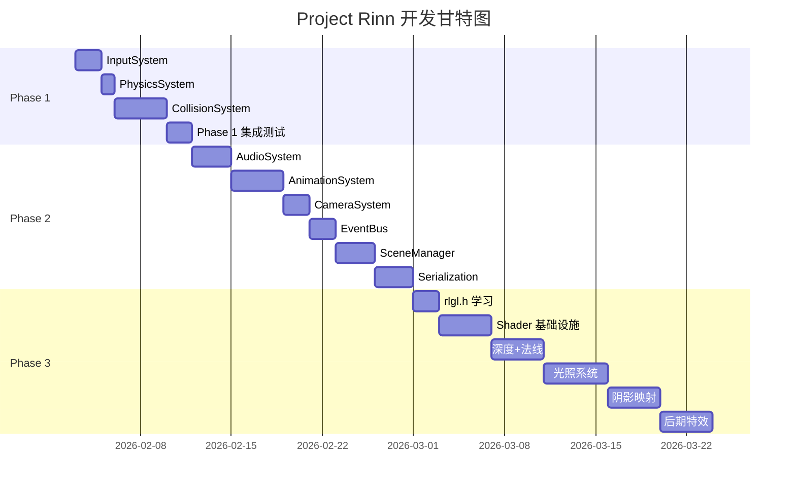

# Project Rinn 开发时间表

**开始日期**: 2026-02-03  
**目标完成日期**: 2026-03-21 (Phase 3 完成)  
**总工期**: 7 周

---

## 总览

---

## Phase 1: 可玩基础 (2026-02-03 → 2026-02-11)

**目标**: WASD 控制角色移动，碰撞检测工作

### Week 1 (02-03 ~ 02-09)

#### Day 1-2: InputSystem

| 日期 | 任务 | 验收标准 |
|------|------|----------|
| 02-03 | 创建 `src/Systems/InputSystem.hpp` | 文件存在 |
| 02-03 | 封装 Raylib 键盘 API | `is_key_down()`, `is_key_pressed()` |
| 02-03 | 封装 Raylib 鼠标 API | `get_mouse_position()`, `is_mouse_down()` |
| 02-04 | Lua 绑定 | `input.is_key_down("W")` 可用 |
| 02-04 | 测试脚本 | Lua 能检测按键 |

**交付物**:
- `src/Systems/InputSystem.hpp`
- `src/Scripting/InputBinder.hpp` (可选，或合并到 LuaBinder)

---

#### Day 3: PhysicsSystem

| 日期 | 任务 | 验收标准 |
|------|------|----------|
| 02-05 | 创建 `src/Systems/PhysicsSystem.hpp` | 文件存在 |
| 02-05 | 实现 `update(Registry&, float dt)` | 遍历 `view<Transform, Velocity>` |
| 02-05 | 位置更新逻辑 | `t.x += v.vx * dt` |
| 02-05 | 主循环集成 | `physics.update(reg, dt)` 每帧调用 |

**交付物**:
- `src/Systems/PhysicsSystem.hpp`
- 实体能移动（Lua 设置 Velocity 后）

---

#### Day 4-7: CollisionSystem

| 日期 | 任务 | 验收标准 |
|------|------|----------|
| 02-06 | 添加 `Collider` 组件 | `type, width, height, offset` |
| 02-06 | 创建 `src/Systems/CollisionSystem.hpp` | 文件存在 |
| 02-07 | 实现 AABB 碰撞检测 | `check_collision(a, b)` 返回 bool |
| 02-07 | 实现碰撞响应 | 阻止穿透（位置修正） |
| 02-08 | 空间划分 (Grid) | 减少 O(N²) 检测 |
| 02-09 | Lua 绑定 | `on_collision(entity_a, entity_b)` 回调 |

**交付物**:
- `src/Systems/CollisionSystem.hpp`
- `Collider` 组件定义
- 碰撞事件可触发 Lua 回调

---

### Week 2 前半 (02-10 ~ 02-11)

#### Day 8-9: Phase 1 集成测试

| 日期 | 任务 | 验收标准 |
|------|------|----------|
| 02-10 | 创建测试场景 | Lua 脚本创建玩家 + 墙壁 |
| 02-10 | WASD 移动测试 | 按键 → 速度 → 位置变化 |
| 02-11 | 碰撞测试 | 玩家不能穿墙 |
| 02-11 | Bug 修复 | 所有发现的问题 |

**里程碑**: ✅ Phase 1 完成 - 可交互 Demo

---

## Phase 2: 完整游戏循环 (2026-02-12 → 2026-02-28)

**目标**: 音频、动画、相机、场景、存档全部可用

### Week 2 后半 (02-12 ~ 02-16)

#### Day 10-12: AudioSystem

| 日期 | 任务 | 验收标准 |
|------|------|----------|
| 02-12 | 创建 `src/Resources/AudioManager.hpp` | RAII 音频资源管理 |
| 02-12 | 封装 Raylib 音效 API | `load_sound()`, `play_sound()` |
| 02-13 | 封装 Raylib 音乐 API | `load_music()`, `play_music()`, `update_music()` |
| 02-13 | 添加 `AudioSource` 组件 | `clip_id, volume, loop, playing` |
| 02-14 | 创建 `src/Systems/AudioSystem.hpp` | 遍历 `view<AudioSource>` |
| 02-14 | Lua 绑定 | `audio.play("footstep")` |

**交付物**:
- `src/Resources/AudioManager.hpp`
- `src/Systems/AudioSystem.hpp`
- 可播放音效和 BGM

---

#### Day 13-16: AnimationSystem

| 日期 | 任务 | 验收标准 |
|------|------|----------|
| 02-15 | 添加 `Animator` 组件 | `frames[], current_frame, speed, loop` |
| 02-15 | 修改 `Sprite` 组件 | 支持 UV 偏移 (spritesheet) |
| 02-16 | 创建 `src/Systems/AnimationSystem.hpp` | 遍历 `view<Animator, Sprite>` |
| 02-17 | 帧更新逻辑 | `timer += dt`, 切换帧 |
| 02-18 | 动画状态机 | `play("walk")`, `play("idle")` |
| 02-18 | Lua 绑定 | `entity:play_anim("attack")` |

**交付物**:
- `src/Systems/AnimationSystem.hpp`
- 角色能播放序列帧动画

---

### Week 3 (02-19 ~ 02-25)

#### Day 17-18: CameraSystem

| 日期 | 任务 | 验收标准 |
|------|------|----------|
| 02-19 | 添加 `Camera` 组件 | `target, offset, zoom, smooth_speed` |
| 02-19 | 创建 `src/Systems/CameraSystem.hpp` | 遍历 `view<Camera>` |
| 02-20 | 跟随逻辑 | 平滑跟随目标实体 |
| 02-20 | 集成 RenderSystem | 应用相机偏移到渲染 |

**交付物**:
- `src/Systems/CameraSystem.hpp`
- 相机跟随玩家

---

#### Day 19-20: EventBus

| 日期 | 任务 | 验收标准 |
|------|------|----------|
| 02-21 | 创建 `src/Events/EventBus.hpp` | 发布/订阅模式 |
| 02-21 | 定义事件类型 | `CollisionEvent`, `InputEvent` |
| 02-22 | 系统间通信 | CollisionSystem → EventBus → ScriptSystem |
| 02-22 | Lua 绑定 | `events.subscribe("collision", callback)` |

**交付物**:
- `src/Events/EventBus.hpp`
- 系统解耦通信

---

#### Day 21-23: SceneManager

| 日期 | 任务 | 验收标准 |
|------|------|----------|
| 02-23 | 创建 `src/Scene/SceneManager.hpp` | 场景加载/卸载 |
| 02-23 | 定义场景格式 | JSON 或 Lua 表 |
| 02-24 | 预制体 (Prefab) | 实体模板复用 |
| 02-25 | 场景切换 | `scene.load("level2")` |

**交付物**:
- `src/Scene/SceneManager.hpp`
- 可从文件加载场景

---

### Week 4 前半 (02-26 ~ 02-28)

#### Day 24-26: Serialization

| 日期 | 任务 | 验收标准 |
|------|------|----------|
| 02-26 | 集成 nlohmann/json | CMake FetchContent |
| 02-26 | 组件序列化 | `to_json()` / `from_json()` |
| 02-27 | Registry 序列化 | 导出所有实体和组件 |
| 02-28 | 存档/读档 API | `game.save("slot1")`, `game.load("slot1")` |

**交付物**:
- 存档/读档功能
- Lua 可调用存档 API

**里程碑**: ✅ Phase 2 完成 - 完整游戏循环

---

## Phase 3: HD-2D 渲染 (2026-03-01 → 2026-03-23)

**目标**: 法线贴图、光照、阴影、后期特效

**技术路线**: Raylib + rlgl.h (低级渲染控制)

### Week 4 后半 (03-01 ~ 03-02)

#### Day 27-28: rlgl.h 学习 ⭐ 新增

| 日期 | 任务 | 验收标准 |
|------|------|----------|
| 03-01 | 阅读 Raylib 源码 `rlgl.h` | 理解 FBO/纹理槽 API |
| 03-01 | 测试 `rlLoadFramebuffer()` | 创建离屏渲染目标 |
| 03-02 | 测试 `rlActiveTextureSlot()` | 多纹理绑定成功 |
| 03-02 | 测试 `rlEnableDepthTest()` | 深度测试生效 |

**交付物**:
- 对 rlgl.h API 有完整理解
- FBO + 多纹理 Demo 运行成功

---

### Week 5 前半 (03-03 ~ 03-06)

#### Day 29-32: Shader 基础设施

| 日期 | 任务 | 验收标准 |
|------|------|----------|
| 03-03 | 创建 `src/Resources/ShaderManager.hpp` | RAII Shader 管理 |
| 03-03 | 创建 `shaders/` 目录 | 组织 GLSL 文件 |
| 03-04 | 编写 `sprite.vert` | 基础顶点变换 |
| 03-04 | 编写 `sprite.frag` | 纹理采样 + 颜色输出 |
| 03-05 | RenderSystem 集成 | `BeginShaderMode()` + rlgl |
| 03-06 | Uniform 传递 | 时间、分辨率 |

**交付物**:
- `src/Resources/ShaderManager.hpp`
- `shaders/sprite.vert`, `shaders/sprite.frag`
- 自定义 Shader 渲染工作

---

### Week 5 (03-05 ~ 03-08)

#### Day 31-34: 深度 + 法线

| 日期 | 任务 | 验收标准 |
|------|------|----------|
| 03-07 | 扩展 `Sprite` | `normal_id`, `z_depth` |
| 03-07 | 创建 `shaders/normal_lit.frag` | 法线采样框架 |
| 03-08 | 法线空间光照 | 点光源计算 |
| 03-09 | 球形法线近似 | Billboard 修正 |
| 03-10 | 深度排序 | 按 z_depth 渲染 |

**交付物**:
- 法线贴图渲染可用
- Sprite 有立体感

---

### Week 5-6 (03-09 ~ 03-13)

#### Day 35-39: 光照系统

| 日期 | 任务 | 验收标准 |
|------|------|----------|
| 03-11 | 添加 `Light` 组件 | `position, color, intensity, radius, type` |
| 03-11 | 创建 `src/Systems/LightSystem.hpp` | 收集光源数据 |
| 03-12 | 创建 `shaders/lit_sprite.frag` | 多光源框架 |
| 03-13 | 实现 Blinn-Phong | 漫反射 + 镜面反射 |
| 03-14 | 光源衰减 | 距离衰减公式 |
| 03-15 | 8 光源上限 | Uniform 数组 |

**交付物**:
- `src/Systems/LightSystem.hpp`
- 多光源实时光照

---

### Week 6 (03-14 ~ 03-17)

#### Day 40-43: 阴影映射

| 日期 | 任务 | 验收标准 |
|------|------|----------|
| 03-16 | 创建 Shadow Map FBO | `rlLoadFramebuffer()` 深度纹理 |
| 03-16 | 编写 `shadow_depth.vert/frag` | 深度输出 |
| 03-17 | Shadow Pass 实现 | 从光源视角渲染 |
| 03-18 | Lighting Pass 修改 | `rlActiveTextureSlot()` 采样 Shadow Map |
| 03-19 | PCF 软阴影 | 3x3 采样模糊 |

**交付物**:
- Shadow Mapping 可用
- 实时阴影

---

### Week 6-7 (03-18 ~ 03-21)

#### Day 44-47: 后期特效

| 日期 | 任务 | 验收标准 |
|------|------|----------|
| 03-20 | 多 Pass 架构 | Scene → FBO → Post |
| 03-20 | Bloom 阈值提取 | `bloom_threshold.frag` |
| 03-21 | Bloom 高斯模糊 | `bloom_blur.frag` |
| 03-21 | Bloom 合成 | `bloom_composite.frag` |
| 03-22 | Tilt-Shift | 移轴模糊 |
| 03-23 | LUT 调色 | 颜色映射 |

**交付物**:
- Bloom 可用
- Tilt-Shift 可用
- LUT 调色可用

**里程碑**: ✅ Phase 3 完成 - HD-2D 渲染

---

## 每日检查清单

每天结束时回答：

- [ ] 今天的任务完成了吗？
- [ ] 代码已 commit 吗？
- [ ] 新功能能可视化验证吗？
- [ ] 明天要做什么？

---

## 风险管理

| 风险 | 概率 | 影响 | 应对 |
|------|------|------|------|
| Shader 调试困难 | 高 | 中 | 预留 2 天缓冲 |
| 碰撞检测 bug | 中 | 高 | 分解为小步骤验证 |
| Raylib 限制 | 低 | 高 | 必要时直接调用 OpenGL |
| 时间冲突 | 中 | 中 | 优先完成 Phase 1+2 |

---

## 缓冲区

| Phase | 预估 | 缓冲 | 总计 |
|-------|------|------|------|
| Phase 1 | 7 天 | +2 天 | 9 天 |
| Phase 2 | 15 天 | +3 天 | 18 天 |
| Phase 3 | 18 天 | +3 天 | 21 天 |

**总计**: 48 天 (约 7 周)

---

## 成功标准

| 日期 | 里程碑 | 验收 |
|------|--------|------|
| **02-11** | Phase 1 | 能 WASD 移动 + 碰撞 |
| **02-28** | Phase 2 | 有音效、动画、存档 |
| **03-23** | Phase 3 | HD-2D 视觉效果完整 |
